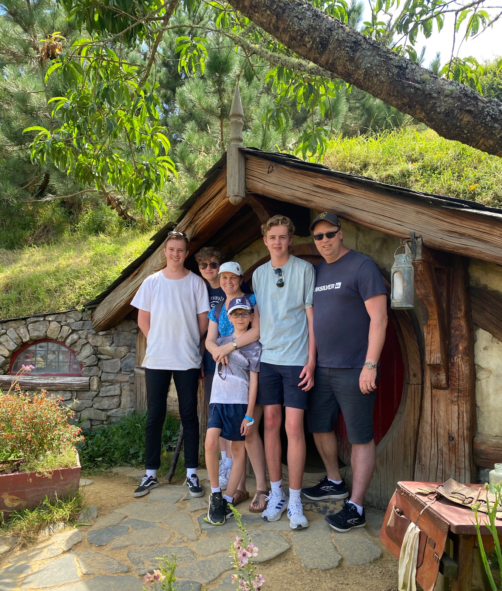

# Education World Travel

Welcome to the Education World Travel website rebuild. This project is a vanilla HTML/CSS/JavaScript version of the Education World Travel site, designed to replace the Wix site with a lightweight, responsive, and GitHub Pages–friendly experience.

## What this project is
This repository contains the static website for Education World Travel, including:

- `index.html` — homepage and hero experience
- `pages/about.html` — About page describing the mission and story
- `pages/blog.html` — blog listing page with posts and filters
- `pages/blog-post.html` — blog post detail template
- `pages/store.html` — store placeholder page
- `pages/downloads.html` — downloads placeholder page
- `404.html` — custom page-not-found experience
- `pages/whats-new.html` — new website feature page

## About Education World Travel
Education World Travel is built around the idea of using travel to educate children and families. It belongs to an educational speech pathologist and mother of four who enjoys traveling with her family and turning every trip into a learning opportunity.

### About page content
- **What is Education World Travel?**
  - The site explains how travel becomes a live classroom for children and parents.
  - It describes the joy of seeing real-world places after reading stories or watching films.
  - The goal is to help families make the most of travel experiences together.

- **About Me**
  - I am an Educational Speech Pathologist and a mum to four beautiful boys — three of whom are now grown up.
  - We live in Australia and love traveling here and around the world.
  - I have homeschooled my children for many years and always look for ways to educate them (and myself) whenever we travel.
  - If this is your passion too, welcome aboard!

## What the GitHub Page is for
This GitHub Pages site is the public home for the Education World Travel rebuild. It is used to:

- host the website online with Github Pages
- share the current site progress and feature updates
- hosts all of the pages and static images on the website
- make it easy for us to publish the latest updates in a few clicks
- allow users to contribute to the project, or report bugs

## Visual features
The site now includes:

- responsive navigation with a mobile hamburger menu
- a custom `whats-new` feature page with animation and highlight cards
- a custom GitHub Pages-friendly 404 page
- placeholder pages for Store and Downloads to avoid broken links

## Project status
The rebuild is actively being built. Current progress includes:

- About page complete
- Blog listing page live
- 404 page fixed for GitHub Pages asset paths
- New website feature page created
- Store/Downloads placeholders in place

What we're planning to add soon:
- Better blog posts with images
- Improvements on CMS (blog post management), SEO (Google/Bing search result engines), and Responsive Design (making the website look and scale great on smaller devices)
- Easy bug-reporting page 
- improved images
- dark theme option

## How to view the site
Standard use-case:
Head to our site at https://andomatthew1234.github.io/Education-world-travel/
For developers: Run the index.html file in your browser.

---

*Site created by Matthew Anderson*